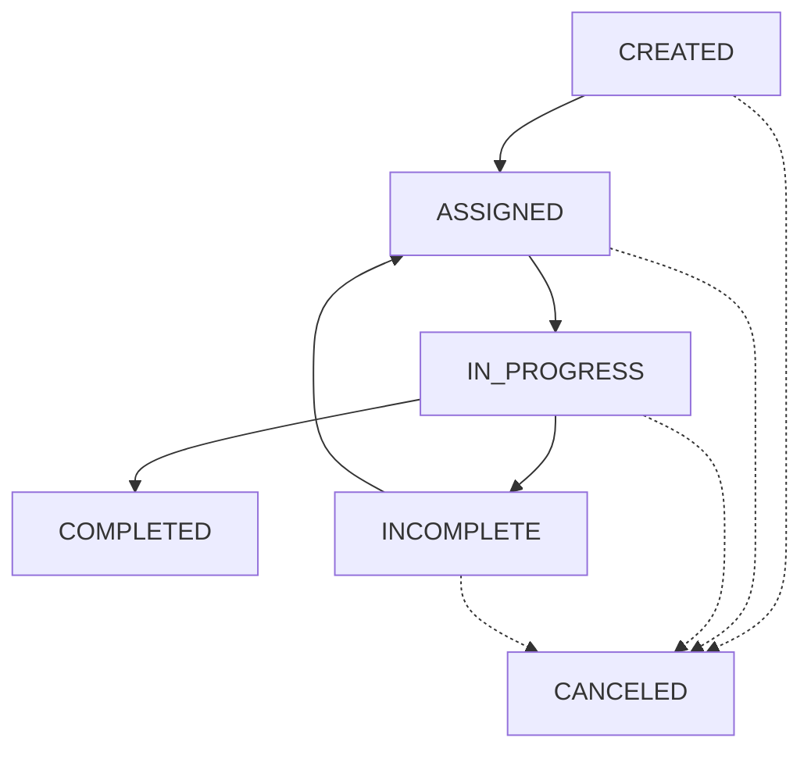

# 01-workorder (Core Domain)

## TL;DR
- **정체성:** 시스템의 모든 액션이 시작되고 끝나는 단일 진입점(Core)
- **FSM:** `CREATED` ➔ `ASSIGNED` ➔ `IN_PROGRESS` ➔ `COMPLETED` (또는 `INCOMPLETE`/`CANCELED`)
- **원칙:** 데이터 물리 삭제 금지(Soft Delete) 및 완료 후 증빙 수정 불가

---

## 1. Overview (개요)

**WorkOrder(작업지시서)**는 본 시스템의 **단일 진입점(Single Entry Point)**이자 핵심 엔티티입니다.  
모든 기능은 WorkOrder의 생명주기를 중심으로 동작하며, 데이터 무결성을 위해 참조(Reference)가 아닌 **스냅샷(Snapshot)** 방식을 지향합니다.

---

## 2. Lifecycle & FSM (상태 모델)

엄격한 상태 전이를 통해 작업의 단계별 무결성을 보장합니다.

### 📊 States 정의
*   **CREATED:** 본사 관리자(Admin)에 의해 작업이 생성되고 DB에 저장된 초기 상태
*   **ASSIGNED:** 팀(Team) 및 기사(Technician) 배정이 완료된 상태
*   **IN_PROGRESS:** 기사가 현장에서 '작업 시작'을 수행한 상태
*   **INCOMPLETE:** 방문했으나 고객 부재, 환경 부적합 등으로 미완료된 상태 (사유 필수)
*   **COMPLETED:** 모든 필수 검증을 통과하여 최종 제출된 상태 (수정 불가 원칙)
*   **CANCELED:** 운영상 이유로 취소된 상태 (사유 필수)

### 🔄 State Flow

### ⚖️ 운영 원칙
*   **No Draft in Backend:** DB에 저장된 시점은 무조건 `CREATED`입니다. 클라이언트의 임시 저장은 프론트엔드 영역에서 처리합니다.
*   **Re-assignment Policy:** 기사 재배정 시에는 `ASSIGNED` 상태를 유지한 채 `technician_id` 필드만 업데이트합니다. (상태 롤백 불필요)
*   **Incomplete/Cancel Reason:** 실패 또는 취소 시 반드시 `reason_type`과 `note`를 기록하여 KPI 통계 데이터로 활용합니다.
*   **Admin Override:** `COMPLETED` 이후 **증빙 데이터(체크리스트, 서명)는 수정이 절대 금지**됩니다. 단, 단순 오타 수정을 위한 Snapshot 필드(고객명, 주소 등)는 Admin 권한에 한해 수정 가능하며, 반드시 History를 남겨야 합니다.

---

## 3. Core Fields (데이터 구조)

### 📝 기본 및 스냅샷 (Identity & Snapshot)
보고서의 일관성을 위해 원본 데이터가 변경되어도 유지되어야 하는 정보를 복사하여 저장합니다.
*   `id`: UUID
*   `type`: INSTALL / SERVICE / AS
*   **[Snapshots]**
    *   `customer_name_snapshot`
    *   `customer_phone_snapshot`
    *   `address_snapshot`
    *   `product_name_snapshot` (표시용)
    *   `product_id_snapshot` (Optional - 통계/AS 연결용)

### 👥 배정 및 일정 (Assignment & Schedule)
*   `team_id` / `technician_id`
*   `scheduled_at` / `started_at` / `completed_at`

### ⚠️ 이슈 및 취소 (Issue & Cancel)
*   `incomplete_reason_type` / `incomplete_note`
*   `cancel_reason_type` / `cancel_note`

---

## 4. Completion & Validation (완료 검증 규칙)

`COMPLETED` 전환 시 서버는 반드시 다음 구조화된 데이터를 검증해야 합니다.

1.  **Checklist Completion:** 
    *   `workorder_checklist_items` 테이블에서 `required=true`인 모든 항목의 `checked` 여부 확인.
    *   **JSONB를 사용하지 않음으로써 개별 항목에 대한 정밀 통계 및 쿼리 가능성을 확보함.**
2.  **Signature:** 고객 서명 이미지 및 서명자 성명 수집 여부.
3.  **Server-side Validation:** 클라이언트의 요청값에 의존하지 않고 서버에서 최종 DB 상태를 재검증함.

---

## 5. History & Audit (이력 관리)

모든 WorkOrder의 변화는 사후 추적을 위해 기록되어야 합니다.

### 📜 workorder_histories
| 필드명 | 설명 |
| :--- | :--- |
| `work_order_id` | 대상 작업 ID |
| `action_type` | STATUS_CHANGE / UPDATE_FIELD / ADMIN_OVERRIDE |
| `from_status` | 변경 전 상태 |
| `to_status` | 변경 후 상태 |
| `changed_by` | 변경 수행자 (User ID) |
| `changed_at` | 변경 시각 |
| `note` | 상세 사유 (특히 Admin 오버라이드 시 필수) |

---

## 6. Design Principles (설계 원칙)

*   **Structural Integrity:** 유연성보다 데이터의 구조적 정합성을 우선한다. (Anti-JSONB for core logic)
*   **Single Source of Truth:** 작업 보고서 생성 시 오직 WorkOrder 내의 Snapshot 데이터만 참조한다.
*   **Soft Delete Only:** 삭제 대신 상태값 관리를 통해 전 생애주기 이력을 보전한다.

---

## 7. Notes
*   **DB Indexing:** 대량 조회를 대비해 다음 필드에 인덱스 설정을 권장합니다: `status`, `team_id`, `technician_id`, `scheduled_at`.
*   향후 Phase 2의 Asset 관리는 WorkOrder 완료 시점에 `Asset` 테이블로 데이터를 밀어넣는 방식으로 확장합니다.
