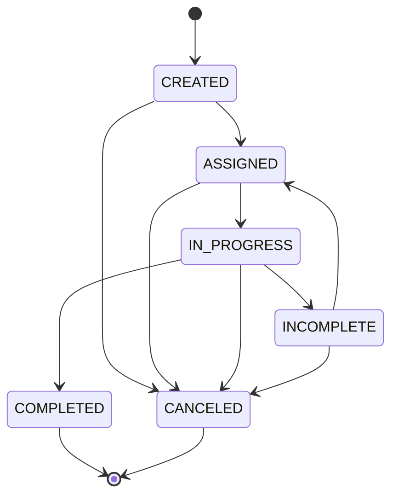

# 30-state-transition-logic (FSM)

## TL;DR
- **핵심:** 상태 전이는 사전에 정의된 '허용된 경로'로만 이동 가능함.
- **검증:** `COMPLETED` 상태는 서버 사이드에서 증빙(체크리스트/서명)을 완벽히 검증한 후 확정함.
- **예외:** `ADMIN_OVERRIDE`를 통해 제한적인 롤백을 허용하되, 모든 이력은 감사 로그로 남김.

---

## 1. Overview (개요)

본 시스템의 WorkOrder는 엄격한 **Finite State Machine(FSM)** 모델을 따릅니다.  
이는 잘못된 상태 변경으로 인한 데이터 오염을 방지하고, 작업의 생애주기를 투명하게 관리하기 위함입니다. 모든 상태 변경은 `workorder_histories` 테이블에 기록되어야 합니다.

### 📊 FSM Diagram



---

## 2. Transition Matrix (전이 허용 행렬)

| 출발 상태 (From) | 도착 상태 (To) | 수행 주체 (Actor) | 비고 |
| :--- | :--- | :--- | :--- |
| **CREATED** | `ASSIGNED` | Admin | 팀 및 기사 배정 |
| | `CANCELED` | Admin | 작업 취소 |
| **ASSIGNED** | `IN_PROGRESS` | Technician | 작업 시작 |
| | `ASSIGNED` | Admin / TM | **기사 재배정** (상태 유지, ID만 변경) |
| | `CANCELED` | Admin / TM | 작업 취소 |
| **IN_PROGRESS** | `COMPLETED` | Technician | **최종 완료** (검증 필수) |
| | `INCOMPLETE` | Technician | **미완료/보류** (사유 필수) |
| | `CANCELED` | Admin / TM | 현장 취소 |
| **INCOMPLETE** | `ASSIGNED` | Admin / TM | **재작업 배정 (데이터 유지 정책 적용)** |
| | `CANCELED` | Admin / TM | 최종 취소 |
| **COMPLETED** | `IN_PROGRESS` | **Admin Only** | **관리자 롤백** (ADMIN_OVERRIDE) |

---

## 3. Detailed Logic per State (상태별 상세 규칙)

### 3.1 CREATED (생성)
*   **의미:** 작업 지시가 생성되었으나 담당자가 지정되지 않은 대기 상태.
*   **Guard:** 필수 필드(고객 정보, 제품 정보) 존재 여부 확인.

### 3.2 ASSIGNED (배정 완료)
*   **의미:** 팀(`team_id`)과 기사(`technician_id`)가 지정된 상태.
*   **Guard:** `technician_id`는 Null일 수 없으며(Phase 1), 해당 기사는 `ACTIVE` 상태여야 함.

### 3.3 IN_PROGRESS (수행 중)
*   **의미:** 기사가 현장에 도착하여 '작업 시작'을 수행한 상태.
*   **Action:** `started_at` 타임스탬프 기록.

### 3.4 COMPLETED (작업 완료 - 중요)
*   **의미:** 모든 현장 업무와 증빙 수집이 완결된 상태.
*   **Guard (서버 강제 검증):**
    1.  해당 WorkOrder에 할당된 모든 `required` 체크리스트 항목이 응답되었는가?
    2.  `signatures` 테이블에 해당 작업의 고객 서명이 존재하는가?
*   **Action:** `completed_at` 기록, 작업 결과 PDF 생성 트리거, Snapshot 데이터 최종 확정.

### 3.5 INCOMPLETE (작업 미완료/보류)
*   **의미:** 방문했으나 고객 부재, 환경 부적합 등으로 작업을 완료하지 못한 상태.
*   **Guard:** `incomplete_reason_type` 및 `incomplete_note` 입력 필수.
*   **Data Policy (재작업 시):**
    - `INCOMPLETE` → `ASSIGNED` 전이 시, 기존에 작성된 체크리스트, 사진, 서명 데이터는 **유지**됨.
    - 재방문한 기사는 기존 데이터를 확인하고 누락되거나 수정이 필요한 부분부터 작업을 재개할 수 있음.

### 3.6 CANCELED (작업 취소)
*   **의미:** 비즈니스적 사유로 인해 작업이 더 이상 진행되지 않기로 결정된 최종 상태.
*   **Guard:** `cancel_reason_type` 필수 입력, `cancel_note` 입력 권장.
*   **특징:** **Terminal State**. 이 상태에 도달한 WorkOrder는 더 이상 다른 상태로 전이할 수 없음.

---

## 4. Exception & Rollback Policy (예외 및 롤백 정책)

현실적인 운영을 위해 `COMPLETED` 상태의 작업을 되돌려야 하는 경우, 다음의 엄격한 절차를 따릅니다.

1.  **권한:** 오직 본사 관리자(`ADMIN`)만이 수행 가능.
2.  **Audit:** `workorder_histories`에 **`ADMIN_OVERRIDE`** 액션 타입으로 기록하며, 수정 사유(`note`)를 반드시 남김.
3.  **Side Effect:** 이미 생성된 PDF 리포트의 무효화 처리를 수동으로 검토해야 함.

---

## 5. Implementation Strategy (구현 전략)

```typescript
// Pseudo-code 예시
async function changeStatus(woId, nextStatus, actor) {
  const wo = await db.workorders.find(woId);
  const allowed = getAllowedTransitions(wo.status);

  // 1. 경로 검증
  if (!allowed.includes(nextStatus)) {
    throw new Error(`Invalid transition: ${wo.status} -> ${nextStatus}`);
  }

  // 2. 권한 및 로직 검증 (Guard)
  if (nextStatus === 'COMPLETED') {
    await validateCompletion(woId);
  }
  
  // 3. 관리자 개입 여부 판단
  const actionType = (wo.status === 'COMPLETED' && actor.role === 'ADMIN') 
    ? 'ADMIN_OVERRIDE' 
    : 'STATUS_CHANGE';

  // 4. 상태 변경 및 이력 기록
  await db.transaction(async (tx) => {
    await tx.workorders.update(woId, { status: nextStatus });
    await tx.histories.create({
      work_order_id: woId,
      from_status: wo.status,
      to_status: nextStatus,
      changed_by: actor.id,
      action_type: actionType, // STATUS_CHANGE 또는 ADMIN_OVERRIDE
      note: payload.note || null
    });
  });
}
```

---

## 6. API Mapping Reference

*   `POST /work-orders/{id}/assign` ➔ **ASSIGNED**
*   `POST /work-orders/{id}/start` ➔ **IN_PROGRESS**
*   `POST /work-orders/{id}/complete` ➔ **COMPLETED**
*   `POST /work-orders/{id}/incomplete` ➔ **INCOMPLETE**
*   `POST /work-orders/{id}/cancel` ➔ **CANCELED**
