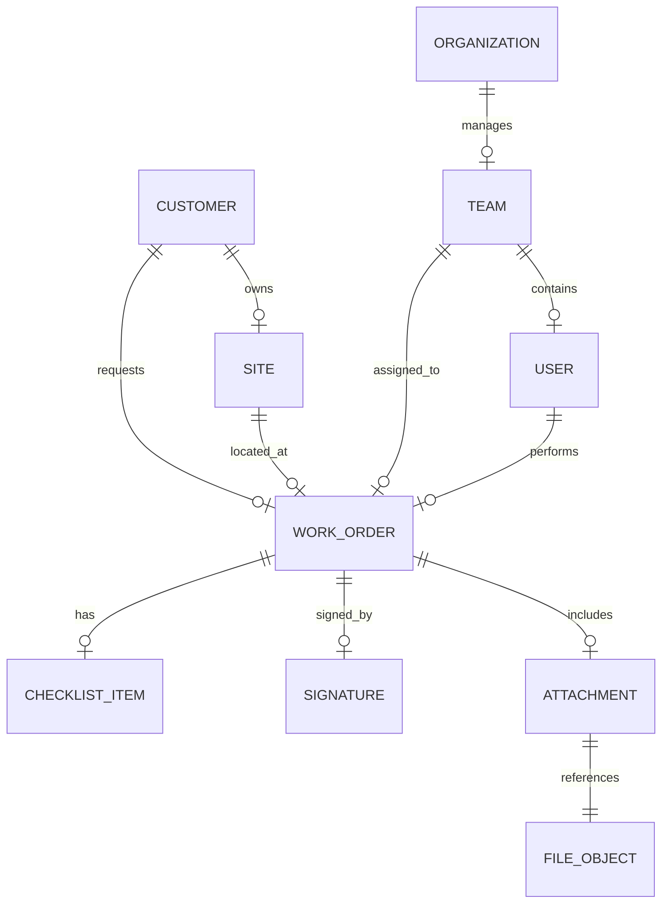

# 데이터 모델 (ERD)

## TL;DR
- **설계 원칙:** Phase 1은 '내부 운영 효율'에 집중하여 재고 관리는 텍스트로 대체하고, 핵심 프로세스(WorkOrder)를 중심으로 설계합니다.

---

## 🗺️ 1. ERD 논리 모델 (Mermaid)

---

## 📋 2. 핵심 테이블 명세 (Core Tables)

### 2.1 조직 및 사용자
| 테이블 | 설명 | 핵심 필드 |
| :--- | :--- | :--- |
| **ORGANIZATION** | 회사(본사) 프로필 (단일 조직 기준 1개) | `legal_name`, `biz_reg_no`, `address`, `phone`, `email`, `created_at`, `updated_at` |
| **TEAM** | 본사 소속 팀/센터 | `id`, `name`(**Immutable**), `address`, `contact_phone`, `status(ACTIVE/INACTIVE)`, `deactivated_at`, `deactivated_reason`, `org_id` |
| **USER** | 시스템 사용자 | `email`, `role(ADMIN/TM/TECH)`, `team_id`, `status(ACTIVE/INACTIVE)`, `deactivated_at` |

### 2.2 고객 및 현장
| 테이블 | 설명 | 핵심 필드 |
| :--- | :--- | :--- |
| **CUSTOMER** | 계약 고객사 | `name`, `contact_info` |
| **SITE** | 실제 작업 현장 | `customer_id`, `address`, `contact_info` |

### 2.3 작업 및 증빙 (핵심)
| 테이블 | 설명 | 핵심 필드 |
| :--- | :--- | :--- |
| **WORK_ORDER** | 설치/AS 작업 건 | `type`, `status`, `scheduled_at`, `assigned_ids` |
| **CHECKLIST_ITEM**| 오더별 점검 결과 | `label`, `value(PASS/FAIL/NA)`, `note` |
| **SIGNATURE** | 고객 서명 정보 | `signed_by_name`, `file_id`, `signed_at` |
| **FILE_OBJECT** | 스토리지 파일 메타 | `storage_key`, `type(PHOTO/SIGN/PDF)` |

---

## ⚙️ 3. 초기 데이터 생성 규칙 (Phase 1)
- **체크리스트 자동 생성:** `WorkOrder` 생성 시 `type`에 따라 미리 정의된 10~12개 항목이 자동으로 `CHECKLIST_ITEM` 테이블에 삽입됩니다.
- **시리얼 번호:** Phase 1에서는 별도 마스터 없이 `WorkOrder` 테이블의 `product_serial_text` 필드에 직접 입력합니다.

---

## ⚠️ 4. Team / User Lifecycle 정책 (Phase 1)

| 엔티티 | 허용 조작 | 금지 조작 | 비고 |
| :--- | :--- | :--- | :--- |
| **TEAM** | `INACTIVE` 비활성화 | **Hard delete** | `name` immutable |
| **USER** | `INACTIVE` 비활성화 | **Hard delete** | 비활성 시 로그인/배정 차단 |

> **Team.name 불변 정책:** 코드를 포함한 모든 연관 시스템에서 일관되게 유지됩니다. API에서 `name` 필드 변경 요청은 서버가 실윤하게 무시합니다.

---

## 📅 5. 구현 마일스톤 (데이터 중심)
1. **M1 (코어):** 인증 및 기초 마스터(Organization, Team, User, Customer, Site) 구축
2. **M2 (프로세스):** WorkOrder 상태 전이 및 배정 로직 구현
3. **M3 (증빙):** 체크리스트 자동 생성 및 파일/서명 업로드 연동
4. **M4 (안정화):** Audit Log 및 발송 결과 트래킹

---

---

## Product Catalog 확장 (Phase 1.x / Gate 2 후보)

> Phase 1 WorkOrder 중심 구조를 유지하면서 상품 카탈로그를 확장하기 위한 데이터 모델 초안.
> 가격/재고는 범위 제외(Phase 2 검토).

### 7. 추가 엔티티 (권장)

#### 1) ProductCategory
- `id` (PK)
- `org_id` (FK) — 멀티 테넌트 고려 시
- `name` (string, required)
- `code` (string, optional, org 내 unique 권장)
- `sort_order` (int, optional)
- `is_active` (bool, default true)
- `created_at`, `updated_at`
- `created_by`, `updated_by` (optional)

#### 2) Product
- `id` (PK)
- `org_id` (FK)
- `category_id` (FK -> ProductCategory.id)
- `name` (string, required)
- `model_name` (string, optional)
- `sku` (string, optional)
- `description` (text, optional)
- `primary_image_file_id` (FK -> FileObject.id, optional)
- `is_active` (bool, default true)
- `created_at`, `updated_at`
- `created_by`, `updated_by` (optional)

#### 3) WorkOrderProduct
- `id` (PK)
- `work_order_id` (FK -> WorkOrder.id)
- `product_id` (FK -> Product.id)
- `quantity` (int, default 1)
- `note` (string/text, optional)
- `sort_order` (int, optional)
- `created_at`, `created_by` (optional)

> Phase 1.x에서는 가격/금액 필드 미포함.
> 향후 필요 시 `unit_price`, `currency`, `price_snapshot` 등을 확장.

---

### 관계 요약

- `ProductCategory 1:N Product`
- `WorkOrder 1:N WorkOrderProduct`
- `Product 1:N WorkOrderProduct`
- `Product.primary_image_file_id -> FileObject` (선택)

---

### 정책 메모

- ProductCategory / Product는 hard delete 대신 `is_active=false` 권장
- 비활성 Product는 신규 WorkOrder 선택 목록에서 제외
- 기존 WorkOrder에 연결된 Product는 상세 조회에서 유지 표시

---

## 연관 문서
- [CRUD 매트릭스](../30-implementation/04-crud-matrix.md)
- [API 명세서](../30-implementation/03-api.md)
- [Org/Team 프로필 정의](../10-domain/05-org-team-profile.md)

## 변경 이력
- **v0.2:** ORGANIZATION 엔티티 추가(OrgProfile), Team/User lifecycle 필드 추가, Mermaid ERD 업데이트 (2026-02-23)
- **v0.1:** 논리 모델 및 단계별 구현 전략 수립 (2025-02-20)